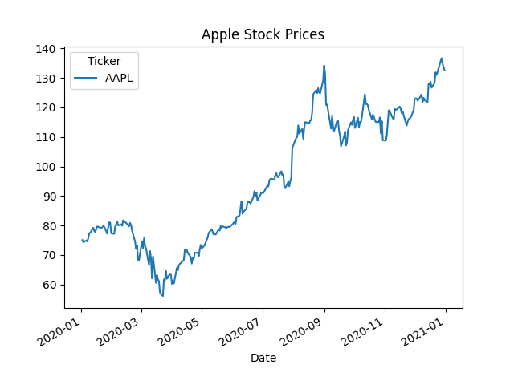

<hr style="height: 5px; background: grey; border: none; margin: 25px 0px 40px 0px;">

# stock-market-assistent
Group project for skills: advanced programming language course in autumn semester 2024

## Introduction
This project implements a...
This app asks for trading symbol of a public traded company. 
Various financial data points will be downloaded from yahoo finance.
Important indicators of the stock will be calculated.
Some numbers will be displayed using charts by pandas.
Depending on user input some light adjusted can be made to the output data.

## Installation

Follow these steps to set up the project on your local machine:

1. **Clone the repository**  
   Clone the project from the Git repository using the following command:
   ```
   git clone https://github.com/c2fel/stock-market-assistent
   ```

2. **Navigate to the project directory**  
   Change into the project directory:
   ```
   cd stock-market-assistent
   ```

3. **Install Python**  
   Ensure that Python is installed on your machine, with a minimum version of 3.x.x and a maximum version of 3.y.y. You can check your Python version with:
   ```
   python --version
   ```
   If you need to install Python, download and install the correct version from the [official Python website](https://www.python.org/downloads/).

4. **Install dependencies**  
   Install all required Python packages listed in `requirements.txt`:
   ```
   pip install -r requirements.txt
   ```

5. **Navigate to the code directory**  
   Change into the code directory:
   ```
   cd code
   ```

6. **Run the program**  
   Finally, run the program using the following command:
   ```
   python main.py
   ```
   
7. **Enter valid ticker symbol**  
   Enter any ticker symbol of a publicly traded stock, such as ```AAPL``` for Apple Inc.


8. **Output**
   Current output should look like this:

   

## Contributions
This project have been built in a collaborative effort by:
- Christoph Büehler
- Joakim Brunstrom
- Christoph Zweifel